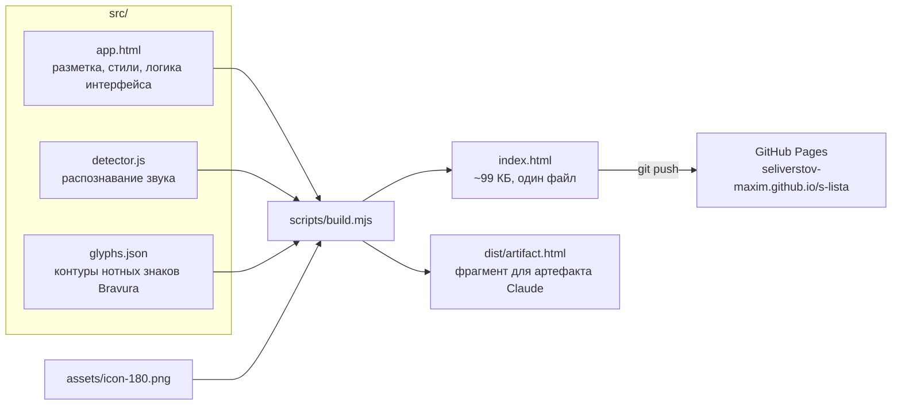
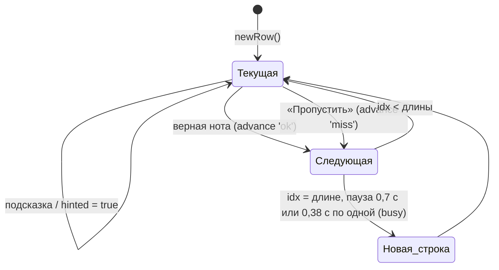
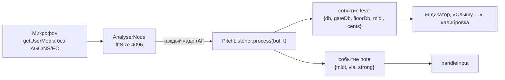

# Техническая документация: «С листа»

## 1. Общая картина

Это статическое одностраничное приложение на чистом JavaScript: без фреймворков, сборщиков и серверной части. Исходники лежат в `src/`. Скрипт `scripts/build.mjs` склеивает их в один файл `index.html` в корне репозитория, и этот файл раздаёт GitHub Pages.



**Сборка.** В `src/app.html` есть две вставки:
- `/*__GLYPHS__*/null` — сюда подставляется JSON с контурами знаков, только поля `d` и `adv`;
- `/*__DETECTOR__*/` — сюда подставляется код `src/detector.js`.

Затем шаблон оборачивается в `<!doctype html>` с мета-тегами для телефона и иконкой в base64. Сборка детерминирована: одинаковые исходники дают побайтно одинаковый `index.html`.

**Выполнение.** Весь код работает в одной IIFE внутри `<script>`. Глобальных переменных нет. Внешний запрос только один — таблица стилей Google Fonts (Onest, Oranienbaum). Если шрифты не загрузились, используются системные.

## 2. Карта кода

`src/app.html` разбит на разделы с комментариями `/* ---------- … ---------- */`:

| Раздел | Что внутри | Ключевые функции |
|---|---|---|
| `<style>` | Токены цвета (`:root`, тёмная тема через `prefers-color-scheme` и `[data-theme]`), вёрстка, клавиатура, панели, калибровка | — |
| Разметка | Шапка, статистика, лист `#score`, пульт (сообщение `#msg`, кнопки, индикатор), клавиатура `#keys`, панели `#settingsPanel`, `#calibPanel`, `#progressPanel` | — |
| Теория | Индекс ступени `d`, MIDI, названия нот | `midiOf`, `shortName`, `fullName`, `spellMidi` |
| Настройки и хранение | Объект `S`, пресеты, `localStorage` | `store.get/set`, `presetId`, `clefFor` |
| Генерация нот | Кандидаты и веса | `candidates`, `difficulty`, `pickNote` |
| Геометрия стана | Расчёт SVG | `geometry`, `yOf`, `glyph`, `noteSVG`, `staffFrame` |
| Состояние упражнения | Строка `row`, флаги | `autoCount`, `newRow` |
| Отрисовка | SVG стана, статистика, уровень, сообщения | `renderScore`, `renderStats`, `renderLevel`, `say`, `idleMessage` |
| Клавиатура на экране | Клавиши и подсветка, звук нажатия | `buildKeys`, `flashKey`, `setHeard`, `setHintKey`, `playTone` |
| Проверка ответа | Правила «верно / ошибка / игнор» | `handleInput`, `advance`, `record` |
| Микрофон | `getUserMedia`, цикл анализа, Wake Lock | `startMic`, `stopMic`, `applyListener`, `onDetector` |
| Калибровка микрофона | Конечный автомат калибровки | `calStart`, `calFeed`, `calFinish`, `calSave`, `renderCal` |
| MIDI | Web MIDI | `connectMidi` |
| Панели | Открытие и закрытие, прогресс, сброс | `openPanel`, `closePanel`, `renderProgress`, `miniStaff` |
| Форма настроек | Связь полей с `S` | `syncForm`, `apply` |
| Кнопки, Запуск | Обработчики, `ResizeObserver`, первичная отрисовка | — |

`src/detector.js` — это `yinDetect`, `makeSpectrum` (БПФ), `harmonicPick` и класс `PitchListener`. Файл не зависит от DOM, поэтому тесты выполняют его в Node (`tests/helpers/load-detector.mjs`).

## 3. Модель нот

- **Индекс ступени** `d = октава·7 + буква`, где до = 0 … си = 6. Октава научная: до первой октавы — C4, `d = 28`.
- **MIDI**: `midiOf(d, acc) = (⌊d/7⌋+1)·12 + STEP[d mod 7] + acc`, где `STEP = [0,2,4,5,7,9,11]` и `acc ∈ {−1, 0, +1}`.
- **Нота упражнения**: `{ d, acc, midi, clef, status: 'todo'|'ok'|'miss', errors, hinted, startAt }`.
- **Написание по MIDI** (`spellMidi`): белые клавиши без знака, чёрные — диезом, или бемолем, если текущая нота с бемолем.
- **Названия**:
  - `shortName` — «ми¹», «Фа», «До₁» или «E4»;
  - `fullName` — «фа-диез первой октавы» или «F♯4».

## 4. Нотный стан (SVG)

- Единица рисунка `SP = 10` — межстрочный интервал. Картинка масштабируется через `viewBox`.
- Нижняя линия стана: у скрипичного ключа `bottomD = 30` (ми¹, E4), у басового `bottomD = 18` (соль большой, G2).
- Высота ноты: `yOf(d) = bottomY − (d − bottomD)·SP/2`.
- Знаки взяты из шрифта Bravura (SMuFL) в виде контуров, `src/glyphs.json`. Координаты в интервалах, ось Y вниз, точка привязки по SMuFL:
  - скрипичный ключ ставится на линию соль (`bottomY − SP`);
  - басовый — на линию фа (`bottomY − 3·SP`);
  - головки и знаки альтерации — по центру ноты.
- `noteSVG` рисует добавочные линейки (ширина 2,1·SP), знак альтерации, головку (ширина 1,18·SP) и штиль (1,2 ед.).
- `staffFrame` рисует 5 линий, ключи, скобку (на большом стане), тактовые черты через каждые 4 ноты и конечную черту.
- Поля сверху и снизу считаются по диапазону (`geometry → need()`), поэтому высота рисунка не прыгает от строки к строке.
- Анимации — CSS-классы на `<g>`: `pop` (верно), `shake` (ошибка), `row-in` (новая строка). Их отключает `prefers-reduced-motion`.

## 5. Упражнение и проверка



Правила `handleInput(midi, via, strong)`. Ввод игнорируется, если открыта панель (`paused`), идёт смена строки (`busy`) или идёт калибровка.
1. Совпадение по MIDI, или по высоте без учёта октавы (`(midi − цель) mod 12 = 0`), если выключено «Требовать точную октаву», — засчитать (`advance('ok')`) и запомнить `lastDone = {midi, t}`.
2. `via === 'legato'` — не засчитывать ошибку.
3. `via === 'onset'` (микрофон) — не засчитывать ошибку, если `!strong` или если это та же нота, что `lastDone`, не позднее 1,5 с. Правило отголосков действует только для микрофона.
4. Иначе (экранная клавиатура, MIDI, уверенный удар) — ошибка: `errors++`, «призрак», сообщение.

Ноты с микрофона не доходят до `handleInput`, пока подключено MIDI-устройство, которое уже присылало ноты (`midiSeen`).

Статистика (`record`): «с первого раза» = `status === 'ok' && errors === 0 && !hinted`. Всё остальное, включая подсказку и пропуск, увеличивает счётчик `e`. Реакция отсчитывается от `startAt` ноты до верного ответа или пропуска, максимум 10 с.

Строка хранит `row.prev` — ноту, сыгранную перед ней. Когда ещё не начатая строка перестраивается (поворот экрана, `newRow(true)`) или меняется уровень, генератор сравнивает первую ноту с реально сыгранной нотой, а не с концом выброшенной строки.

## 6. Распознавание звука (`detector.js`)

### Цепочка



### Шаги на каждом кадре

1. **Громкость.** RMS последних 512 отсчётов (~11 мс), в дБFS.
2. **Прогрев.** Первые 600 мс после включения только изучается фон, удары и легато не распознаются.
3. **Рабочий порог.** `gate = max(gateDb, floorDb + 8)`. Здесь `gateDb` — из настройки или калибровки, `floorDb` — шумовой фон.
4. **Удар (onset).** Условия: `rms > gate`, `rms > env·1,4 + gate·0,25` и не чаще раза в 90 мс. Огибающая `env = max(rms, env·0,93^(dt/16,7))`. В момент удара запоминается спектр предыдущего кадра.
5. **Высота (YIN).** Считается, если `rms > 0,6·gate`.
   - Сигнал прореживается ×2, если частота дискретизации ≥ 32 кГц.
   - Порог YIN 0,15.
   - Если порог не пройден, берётся глобальный минимум с поправкой на октаву. Кандидаты τ/4, τ/3, τ/2 проверяются по порядку (короткий период первым), каждый в окне ±max(2, 4 %). Берётся первый, у которого минимум меньше `min + 0,12` и меньше 0,5.
   - Параболическая интерполяция.
   - Высота «надёжна», если апериодичность `ap < 0,25` и `rms > gate`.
6. **Решение после удара.** Начинается через `settleMs = max(30, 0,85·окно)`. На каждом кадре:
   - спектр сейчас (БПФ 4096, окно Ханна) минус спектр до удара — это «новая энергия». Если она меньше 12 % текущей, кадр пропускается;
   - `harmonicPick` — гармоническая сумма по кандидатам от «низ − 5» до «верх + 12» полутонов;
   - если YIN уверен (`ap < 0,2`) и отличается не больше чем на 2 полутона, берётся точное значение YIN.
   - Три совпавших голоса — нота (`strong`, если пик после удара на 6 дБ выше порога). Через 420 мс нота с ≥ 2 голосами выдаётся как неуверенная.
7. **Легато.** Та же надёжная высота держится ≥ 130 мс, нет сбора после удара, она отличается от последней выданной ноты и не на целое число октав. Тогда выдаётся нота `via: 'legato'`.
8. **Шумовой фон.** Минимум громкости по 30 корзинам по 100 мс. Учитываются только «немузыкальные» кадры: `ap > 0,3` и больше 1,2 с после удара, либо прогрев. Поэтому фон не подстраивается под звучание самого пианино.

### Параметры

| Параметр | Значение | Зачем |
|---|---|---|
| Окно анализатора | 4096 отсчётов (~85 мс) | Хватает для 2,5+ периодов самых низких нот |
| Диапазон поиска YIN | `fmin = max(45 Гц; 0,97·f(низ − 5))`, `fmax = min(fs/4; 1,06·f(верх + 12))`. Приложение передаёт диапазон упражнения, расширенный на ±1 полутон, то есть относительно упражнения это −6…+13 полутонов | Отсекает «общий бас» аккорда при педали |
| Окно YIN `W` | `max(256, min(3·τmax, N/dec − τmax − 1))` | Короче для высоких диапазонов, меньше задержка |
| Гармоник в `harmonicPick` | Кандидаты от «низ − 5» до «верх + 12» полутонов (в пределах MIDI 21…108); до 12 гармоник, до 5 кГц, допуск `1,5 % + 0,2 %·k`, вес `k^−0,6` | Растяжка обертонов фортепиано |
| Штраф субгармоник | `0,7·max(полуцелые, третьи)` | Защита от ошибки «на октаву вверх» |
| Отголосок | 1,5 с (в `app.html`) | Двойной удар молоточка, эхо |

### Почему так

- **Только YIN** путался, когда предыдущая нота ещё звучит: смесь до¹+ми¹ даёт «общий период» До большой. **Разность спектров** выделяет то, что появилось после удара.
- **Спектр** на басах грубоват: бин 11,7 Гц при полутоне ~4 Гц. Поэтому точную высоту уточняет YIN.
- **Асимметрия.** Верную ноту принимаем по любому пути (удар или легато), а ошибку засчитываем только при уверенном ударе. Пропуск для ученика менее болезнен, чем ложная ошибка.

## 7. Калибровка

Калибровка — конечный автомат `cal.state`: `idle → intro → silence → notes → done | fail`. Данные идут из событий `level` детектора (`d.db`, `d.t`).
- **Тишина** (3 с): `noiseDb` = 95-й перцентиль громкости.
- **Ноты**: удар — `db > noise + 10`, `db > env + 4`, не чаще раза в 350 мс. Пик берётся за 300 мс. Огибающая спадает на 0,6 дБ за кадр. Шаг заканчивается после 5 нот или через 30 с.
- **Порог**: формула в [requirements.md](requirements.md), FR-CAL-03. Результат записывается в `S.gateDb` и `S.calibrated = true`.

## 8. Хранение

`localStorage`, все обращения в `try/catch`:

```text
slista.settings.v1 = {
  clef: 'treble'|'bass'|'grand', lo: d, hi: d,          // границы диапазона — индексы ступеней белых клавиш
  acc: bool, motion: 'any'|'step', perRow: 'row'|'one',
  naming: 'solfege'|'letters', octave: bool, adaptive: bool,
  gateDb: число (−80…−20), calibrated: bool,
  showKeys: bool, keySound: bool
}
slista.stats.v1 = {
  n: всего нот, first: с первого раза,
  notes: { "treble:30:0": { n: попыток, e: не с первого раза, ms: сумма реакций }, … }   // ключ = ключ:d:acc
}
```

Совместимые изменения делайте с переносом данных при загрузке, без смены ключа: так перенесено старое поле `sens` в `gateDb`. При несовместимых изменениях поднимайте версию в имени ключа (`v2`).

## 9. Ввод с MIDI

`navigator.requestMIDIAccess()`. На каждый вход вешается `onmidimessage`. Нотой считается событие `0x9n` со скоростью больше 0. На `onstatechange` список входов строится заново. Когда устройство подключено, микрофон выключается (`stopMic`), а `midiSeen` глушит ноты с микрофона.

## 10. Развёртывание

- Репозиторий: `github.com/seliverstov-maxim/s-lista`, публичный.
- GitHub Pages: ветка `main`, папка `/` (root). Файл `.nojekyll` отключает обработку Jekyll.
- Сайт: https://seliverstov-maxim.github.io/s-lista/ — обновляется через 1–2 минуты после `git push`.
- Микрофону нужен https, Pages его даёт. Для проверки на компьютере — `npm run serve`, открыть http://localhost:8080.

## 11. Ограничения

- Внутри встроенных фреймов, где запрещён микрофон (артефакт Claude), работает только экранная клавиатура.
- На iOS нет Web MIDI ни в одном браузере.
- С педалью ноты сливаются: возможны пропуски (без ложных ошибок).
- Тихая неверная нота может не засчитаться как ошибка — это цена защиты от ложных ошибок.
- Логика интерфейса живёт в одной IIFE и не покрыта unit-тестами, только e2e.
- Распознавание проверено на синтезированном звуке и искусственном микрофоне. Записей настоящего пианино в тестах пока нет.
