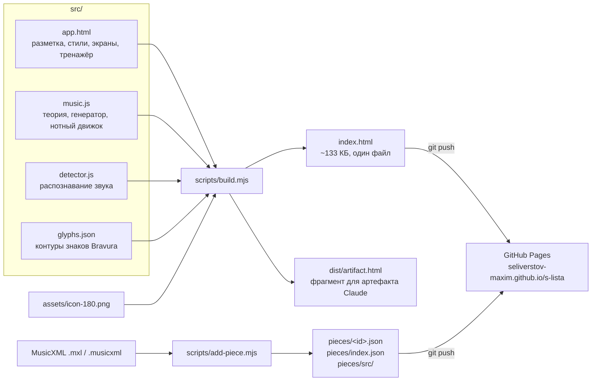
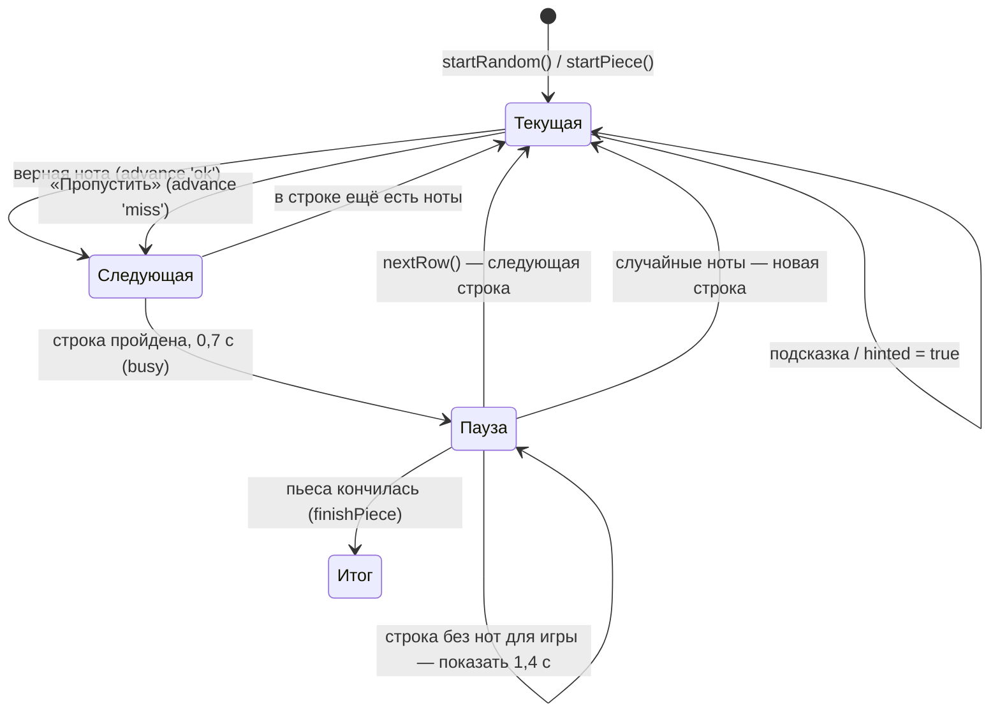
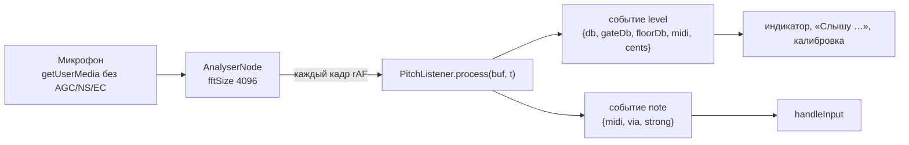

# Техническая документация: «С листа»

## 1. Общая картина

Это статическое одностраничное приложение на чистом JavaScript: без фреймворков и серверной части. Исходники лежат в `src/`. Скрипт `scripts/build.mjs` склеивает их в один файл `index.html` в корне репозитория, и этот файл раздаёт GitHub Pages. Пьесы лежат отдельными файлами в `pieces/`; их готовит инструмент `scripts/add-piece.mjs` из MusicXML.



**Сборка.** В `src/app.html` три вставки:
- `/*__GLYPHS__*/null` — JSON с контурами знаков, только поля `d` и `adv`;
- `/*__MUSIC__*/` — код `src/music.js`;
- `/*__DETECTOR__*/` — код `src/detector.js`.

Затем внутри `<style>` и `<script>` убираются отступы, пустые строки и строки, целиком состоящие из одного комментария (`// …` или один `/* … */`). Переносы строк остаются, поэтому смысл кода не меняется; комментарии остаются только в исходниках. Следствие: **строка кода не должна начинаться с `//`** — даже внутри многострочного шаблона. Шаблон оборачивается в `<!doctype html>` с мета-тегами и иконкой в base64. Сборка детерминирована.

**Выполнение.** Весь код работает в одной IIFE внутри `<script>`. Глобальных переменных нет. Внешние запросы — таблица стилей Google Fonts (Onest, Oranienbaum) и файлы пьес с того же сайта (`pieces/index.json`, `pieces/<id>.json`). Если шрифты не загрузились, используются системные.

## 2. Карта кода

`src/music.js` — чистые функции без DOM. Их же загружают тесты (`tests/helpers/load-music.mjs`) и сравнивает с инструментом тест правила линеек.

| Раздел | Что внутри | Ключевые функции |
|---|---|---|
| Теория | Ступень `d`, MIDI, названия нот | `midiOf`, `shortName`, `fullName`, `spellMidi` |
| Диапазон по линейкам | FR-RND-02 | `ledgerRange`, `linesNeeded` |
| Случайные ноты | Кандидаты и выбор без повторов | `candidates`, `pickNote` |
| Отголоски | FR-CHK-03, FR-PC-07 | `isEcho` |
| Настройки | Значения по умолчанию, перенос версии 1 | `SETTINGS_DEFAULTS`, `migrateSettings` |
| Партитура | Длительности в тиках, пьеса → партитура, строка случайных нот | `durOf`, `beatOf`, `buildScore`, `randomScore` |
| Штили и рёбра | Направление и длина штилей, геометрия групп | `prepareScore`, `beamGroup` |
| Раскладка | Такты по строкам, перенос такта, растяжение | `layoutRows`, `chooseSplit`, `rowFactor`, `placeRow`, `rowOfNote` |
| Высота рисунка | Одна высота на всю партитуру | `scoreVBox` |
| Отрисовка | SVG строки, мини-стан | `renderRow`, `staffSVG`, `noteHeadSVG`, `beamSVG`, `restSVG`, `tieSVG` |

`src/app.html` разбит на разделы с комментариями `/* ---------- … ---------- */`:

| Раздел | Что внутри | Ключевые функции |
|---|---|---|
| `<style>` | Токены цвета (`:root`, тёмная тема через `prefers-color-scheme` и `[data-theme]`), экраны, лист, клавиатура, панели | — |
| Разметка | Экраны `#homeScreen`, `#randomScreen`, `#piecesScreen`, `#playScreen`; панели `#settingsPanel`, `#calibPanel`, `#progressPanel`, `#donePanel` | — |
| Настройки и хранение | Объект `S`, `store`, перенос версии 1 | `store.get/set`, `save` |
| Экраны и история | Переходы, `popstate` | `show`, `go`, `continueLast` |
| Главный экран, настройка случайных нот, список пьес | — | `renderHome`, `renderSetup`, `renderPieces`, `openPiece` |
| Упражнение | Состояние `ex`, запуск | `startRandom`, `newRandomRow`, `startPiece`, `leavePlay` |
| Отрисовка | Стан, статистика, шапка, сообщения | `renderScore`, `renderStats`, `renderTitle`, `say`, `idleMessage` |
| Клавиатура на экране | Клавиши и подсветка | `buildKeys`, `flashKey`, `setHeard`, `setHintKey` |
| Звук рояля | Записи, ограничитель, запасной синтез, звук нажатия | `audioOut`, `loadPiano`, `preloadPiano`, `voice`, `synthVoice`, `playTone` |
| Проверка ответа | Правила «верно / ошибка / игнор», смена строк, итог | `handleInput`, `advance`, `nextRow`, `record`, `finishPiece` |
| Микрофон | `getUserMedia`, цикл анализа, Wake Lock | `startMic`, `stopMic`, `applyListener`, `onDetector` |
| Калибровка микрофона | Конечный автомат калибровки | `calStart`, `calFeed`, `calFinish`, `calSave`, `renderCal` |
| MIDI | Web MIDI | `connectMidi` |
| Панели | Открытие и закрытие через историю, прогресс, сброс | `openPanel`, `closePanel`, `renderProgress` |
| Общие настройки, кнопки, запуск | Форма, обработчики, `ResizeObserver` | `syncForm` |

`src/detector.js` — это `yinDetect`, `makeSpectrum` (БПФ), `harmonicPick` и класс `PitchListener`. Файл не зависит от DOM, поэтому тесты выполняют его в Node (`tests/helpers/load-detector.mjs`).

`scripts/make-piano.mjs` — записи рояля для `sounds/piano/` из архива Salamander Grand Piano V3 (нужен ffmpeg).

`scripts/add-piece.mjs` и `scripts/lib/` — инструмент загрузки пьес: `xml.mjs` (маленький XML-парсер), `zip.mjs` (чтение `.mxl`), `musicxml.mjs` (проверки и перевод MusicXML в данные пьесы).

## 3. Модель нот

- **Индекс ступени** `d = октава·7 + буква`, где до = 0 … си = 6. Октава научная: до первой октавы — C4, `d = 28`.
- **MIDI**: `midiOf(d, acc) = (⌊d/7⌋+1)·12 + STEP[d mod 7] + acc`, где `STEP = [0,2,4,5,7,9,11]` и `acc ∈ {−1, 0, +1}`.
- **Длительность** в тиках: 48 на четверть, `durOf(len, dots)`; `len` — 1 целая … 16 шестнадцатая.
- **Партитура** (`buildScore`, `randomScore`): `{ clef, measures, notes }`.
  - Такт: `{ time, key, tempo, prevKey, showTime, showKey, full, pickup, items }`; `showTime`/`showKey` — смена в этом такте, `tempo` — действующий темп.
  - Нота: `{ type: 'note', d, acc, midi, clef, len, dots, dur, start, mark, tie, tieFrom, head, tieTo, beam, stem, group, status, errors, hinted, startAt, idx }`.
  - Пауза: `{ type: 'rest', len, dots, dur, start, measure }`.
  - `notes` — только играемые ноты по порядку (`idx`). Продолжение лиги (`tieFrom`) не играется; его цвет берётся у первой ноты лиги (`head`).
- **Данные пьесы** (`pieces/<id>.json`) — формат в [spec-2.0.md](spec-2.0.md), «Данные пьесы». Версия в ключе — сдвиг `d` на `7·shift[clef]`.
- **Написание по MIDI** (`spellMidi`): белые клавиши без знака, чёрные — диезом, или бемолем, если текущая нота с бемолем.

## 4. Нотный движок

- Единица рисунка `SP = 10` — межстрочный интервал. `y` ноты считается от нижней линии стана (`yRel`), нижняя линия: скрипичный `bottomD = 30` (ми¹), басовый `bottomD = 18` (соль большой).
- Знаки — контуры Bravura (SMuFL) в `src/glyphs.json`, в интервалах, ось Y вниз, точка привязки по SMuFL: ключи — на своей линии, головки и знаки альтерации — по центру ноты, паузы — от средней линии (целая висит на четвёртой), цифры размера — по центру, числитель на четвёртой линии, знаменатель на второй. Флажки крепятся к концу штиля.
- **Штили** (`prepareScore`): ниже средней линии — вверх справа, иначе вниз слева; 3,5 интервала, но до средней линии.
- **Рёбра** (`beamGroup`): группы — по `beam[0]` из данных пьесы. Если группу разорвал перенос строки, ребро куска идёт по концам его крайних штилей, а нота, оставшаяся в строке одна, получает обычный штиль и флажок. Направление решает нота, дальше всех от средней линии; наклон — половина разницы крайних нот, не больше интервала, ровно, если внутренняя нота выступает; ребро не ближе к нотам, чем средняя линия; штили не короче 3 интервалов (+0,75 на второе ребро). Второе ребро и «крючки» — по `beam[1]` или по соседним шестнадцатым.
- **Раскладка** (`layoutRows`): у каждого такта есть неизменная часть (отступ после черты, знаки альтерации, точки) и «пружины» — расстояния между нотами `(2,3 + 2,1·(dur/четверть)^0,6)·SP`. Строка набирается целыми тактами, пока они помещаются при сжатии пружин до 85 %. Такт шире строки переносится (`chooseSplit`): сначала на границе доли вне группы восьмых, потом вне группы, в крайнем случае внутри группы — так, чтобы по обе стороны осталось не меньше двух её нот; если остаток помещается в одну строку, выбирается самый ровный перенос. Такт, который не влезает и в новую строку, начинается в текущей. Каждая строка начинается с ключа и ключевых знаков; размер — в первой строке и при смене; смена посреди строки — бекары отменяемых знаков, новые знаки, новый размер.
- **Растяжение** (`rowFactor`): пружины растягиваются до ширины листа, но не больше чем в 1,35 раза, и сжимаются не меньше чем до 0,7. Недобранная строка короче: стан кончается тактовой чертой. Строка, оборванная посреди такта, — стан до края без черты.
- **Высота** (`scoreVBox`): одна на всю партитуру — по всем нотам, штилям, рёбрам, знакам и лигам плюс место для подсказки. Поэтому стан не прыгает от строки к строке.
- **Строка в SVG** (`renderRow`): полоса текущей ноты, стан и шапка строки, тактовые черты, ноты и паузы, лиги (через перенос строки — две половинки), рёбра, подпись-подсказка, «призрак» неверной ноты. У играемой ноты — `data-i`, `data-midi`, `data-d` и класс `cur` у текущей; у добавочной линейки — класс `lg` (на них опираются тесты).
- Анимации — CSS-классы на `<g>`: `pop` (верно), `shake` (ошибка), `row-in` (новая строка). Их отключает `prefers-reduced-motion`.

## 5. Экраны и история

- Экраны — секции `#homeScreen`, `#randomScreen`, `#piecesScreen`, `#playScreen`; видна одна. Адрес — `#random`, `#pieces`, `#play`, главный — без хеша.
- При запуске текущая запись истории заменяется на главный экран. Переход вперёд (`go`) кладёт запись; «Назад» в приложении — `history.back()`; экран меняется по `popstate`.
- «Продолжить» и перезагрузка на `#play` кладут в историю сначала экран выбора (`#random` или `#pieces`), потом тренажёр.
- Открытая панель — запись `{ s, panel }`; закрытие — `history.back()`, поэтому системная «Назад» закрывает панель, а «Вперёд» открывает снова. Действие после закрытия (`closePanel(then)`) выполняется в `popstate`; пока возврат не пришёл, повторное закрытие игнорируется.
- Перезагрузка сохраняет историю вкладки и `history.state`: приложение продолжает с этой записи (панель после перезагрузки закрыта — её запись снимается `history.back()`). Новые записи строятся только при открытии по ссылке.
- При уходе с тренажёра упражнение сбрасывается (`leavePlay`); таймеры смены строк проверяют, что упражнение то же самое. «Вперёд» браузера на `#play` запускает последнее упражнение заново.

## 6. Упражнение и проверка



Правила `handleInput(midi, via, strong)`. Ввод игнорируется, если открыта панель (`paused`), идёт смена строки (`busy`), экран не тренажёр или нет текущей ноты.
1. `isEcho(midi, via, strong, lastDone, now, hit)` — звук с микрофона той же клавиши, что засчитана последней (`lastDone`): как верный ответ — только уверенный удар не раньше 250 мс, как ошибка — не раньше 1,5 с. Такой звук игнорируется.
2. Совпадение по MIDI, или по высоте без учёта октавы (`(midi − цель) mod 12 = 0`), если выключено «Требовать точную октаву», — засчитать (`advance('ok')`) и запомнить `lastDone = {midi, t}`.
3. `via === 'legato'` — не засчитывать ошибку. `via === 'onset'` и `!strong` — тоже.
4. Иначе (экранная клавиатура, MIDI, уверенный удар) — ошибка: `errors++`, «призрак», сообщение.

Ноты с микрофона не доходят до `handleInput`, пока подключено MIDI-устройство, которое уже присылало ноты (`midiSeen`), и пока идёт калибровка.

Статистика (`record`): «с первого раза» = `status === 'ok' && errors === 0 && !hinted`. Всё остальное, включая подсказку и пропуск, увеличивает счётчик `e`. Реакция отсчитывается от `startAt` ноты до верного ответа или пропуска, максимум 10 с. Время пьесы в итоге — сумма времени на ноты.

**Случайные ноты.** Строка — `randomCount` четвертей (от 3 до 8, сколько помещается без сжатия), по 4 в такте, в конце — конечная черта. Строка хранит `ex.prev` — ноту, сыгранную перед ней: когда ещё не начатая строка перестраивается (поворот экрана), генератор сравнивает первую ноту с реально сыгранной нотой, а не с концом выброшенной строки.

**Ширина листа.** `sheetUnits()` — ширина в единицах рисунка: у пьес масштаб не меньше 1,1 px на единицу (интервал 11 px), у случайных нот — 1,25 (12,5 px), на широком экране — до 1,7. При изменении ширины пьеса раскладывается заново, текущая нота остаётся текущей.

**Проигрыш пьесы** (FR-PC-11). `playbackPlan(score, from)` в `music.js` даёт события от первого знака текущей строки до конца: начало и конец в секундах по темпу такта (`tempo` — четвертей в минуту), у первой ноты лиги — конец всей лиги (`soundEnd`). В `app.html` проигрыш (`pb`) раз в 40 мс ставит в очередь `AudioContext` звуки на полсекунды вперёд (`voice` — тот же звук рояля, что у экранной клавиатуры, см. ниже) и подсвечивает знак, который звучит сейчас (`renderRow`, опция `play`); строка — по `itemRowMap`. Пока `pb` не пуст, `handleInput`, клавиатура, подсказка, пропуск и микрофонная кнопка не работают; после остановки 1,2 с (`micMuteUntil`) не засчитывается звук с микрофона. Панели и уход с экрана останавливают проигрыш.

**Звук рояля** (FR-UI-04). `audioOut()` создаёт `AudioContext` и общий ограничитель громкости (`DynamicsCompressorNode`, порог −10 дБ), через который идут все ноты. Записи — `sounds/piano/<нота>.mp3`: C1–C7 через малую терцию (`C`, `Ds`, `Fs`, `A`), `pianoBase(m)` — ближайшая запись, `pianoFile(b)` — её файл. `startExercise` вызывает `preloadPiano()`: записи для всей клавиатуры на экране, если включён звук клавиш или открыта пьеса. `loadPiano` декодирует файлы в `AudioBuffer` и запоминает `off` — где начинается удар (`onsetOf`: MP3 начинается с тишины кодировщика, браузеры срезают её по-разному). `voice(ctx, midi, t, end, nodes)` играет запись со скоростью 2^(сдвиг/12); `end` — момент, когда «демпфер» глушит струну (у проигрыша — конец ноты, у клавиатуры его нет — запись затихает сама). Нет записи — `loadPiano` для этой ноты и `synthVoice` (четыре гармоники). `playTone` помнит звук каждой клавиши (`keyVoices`) и глушит его при повторном нажатии. Файлы готовит `scripts/make-piano.mjs` из архива Salamander (ADR-13).

## 7. Распознавание звука (`detector.js`)

### Цепочка



Приложение передаёт детектору диапазон упражнения или версии пьесы, расширенный на ±1 полутон (`applyListener`).

### Шаги на каждом кадре

1. **Громкость.** RMS последних 512 отсчётов (~11 мс), в дБFS.
2. **Прогрев.** Первые 600 мс после включения только изучается фон, удары и легато не распознаются.
3. **Рабочий порог.** `gate = max(gateDb, floorDb + 8)`. Здесь `gateDb` — из настройки или калибровки, `floorDb` — шумовой фон.
4. **Удар (onset).** Условия: `rms > gate`, `rms > env·1,4 + gate·0,25` и не чаще раза в 90 мс. Огибающая `env = max(rms, env·0,93^(dt/16,7))`. В момент удара запоминается спектр предыдущего кадра.
5. **Высота (YIN).** Считается, если `rms > 0,6·gate`.
   - Сигнал прореживается ×2, если частота дискретизации ≥ 32 кГц.
   - Порог YIN 0,15.
   - Если порог не пройден, берётся глобальный минимум с поправкой на октаву. Кандидаты τ/4, τ/3, τ/2 проверяются по порядку (короткий период первым), каждый в окне ±max(2, 4 %). Берётся первый, у которого минимум меньше `min + 0,12` и меньше 0,5.
   - Параболическая интерполяция.
   - Высота «надёжна», если апериодичность `ap < 0,25` и `rms > gate`.
6. **Решение после удара.** Начинается через `settleMs = max(30, 0,85·окно)`. На каждом кадре:
   - спектр сейчас (БПФ 4096, окно Ханна) минус спектр до удара — это «новая энергия». Если она меньше 12 % текущей, кадр пропускается;
   - `harmonicPick` — гармоническая сумма по кандидатам от «низ − 5» до «верх + 12» полутонов;
   - если YIN уверен (`ap < 0,2`) и отличается не больше чем на 2 полутона, берётся точное значение YIN.
   - Три совпавших голоса — нота (`strong`, если пик после удара на 6 дБ выше порога). Через 420 мс нота с ≥ 2 голосами выдаётся как неуверенная.
7. **Легато.** Та же надёжная высота держится ≥ 130 мс, нет сбора после удара, она отличается от последней выданной ноты и не на целое число октав. Тогда выдаётся нота `via: 'legato'`.
8. **Шумовой фон.** Минимум громкости по 30 корзинам по 100 мс. Учитываются только «немузыкальные» кадры: `ap > 0,3` и больше 1,2 с после удара, либо прогрев. Поэтому фон не подстраивается под звучание самого пианино.

### Параметры

| Параметр | Значение | Зачем |
|---|---|---|
| Окно анализатора | 4096 отсчётов (~85 мс) | Хватает для 2,5+ периодов самых низких нот |
| Диапазон поиска YIN | `fmin = max(45 Гц; 0,97·f(низ − 5))`, `fmax = min(fs/4; 1,06·f(верх + 12))`. Относительно упражнения это −6…+13 полутонов | Отсекает «общий бас» аккорда при педали |
| Окно YIN `W` | `max(256, min(3·τmax, N/dec − τmax − 1))` | Короче для высоких диапазонов, меньше задержка |
| Гармоник в `harmonicPick` | Кандидаты от «низ − 5» до «верх + 12» полутонов (в пределах MIDI 21…108); до 12 гармоник, до 5 кГц, допуск `1,5 % + 0,2 %·k`, вес `k^−0,6` | Растяжка обертонов фортепиано |
| Штраф субгармоник | `0,7·max(полуцелые, третьи)` | Защита от ошибки «на октаву вверх» |
| Отголосок | 1,5 с как ошибка, 250 мс как повтор (`isEcho` в `music.js`) | Двойной удар молоточка, эхо |

### Почему так

- **Только YIN** путался, когда предыдущая нота ещё звучит: смесь до¹+ми¹ даёт «общий период» До большой. **Разность спектров** выделяет то, что появилось после удара.
- **Спектр** на басах грубоват: бин 11,7 Гц при полутоне ~4 Гц. Поэтому точную высоту уточняет YIN.
- **Асимметрия.** Верную ноту принимаем по любому пути (удар или легато), а ошибку засчитываем только при уверенном ударе. Пропуск для ученика менее болезнен, чем ложная ошибка.

## 8. Калибровка

Калибровка — конечный автомат `cal.state`: `idle → intro → silence → notes → done | fail`. Данные идут из событий `level` детектора (`d.db`, `d.t`).
- **Тишина** (3 с): `noiseDb` = 95-й перцентиль громкости.
- **Ноты**: удар — `db > noise + 10`, `db > env + 4`, не чаще раза в 350 мс. Пик берётся за 300 мс. Огибающая спадает на 0,6 дБ за кадр. Шаг заканчивается после 5 нот или через 30 с.
- **Порог**: формула в [requirements.md](requirements.md), FR-CAL-03. Результат записывается в `S.gateDb` и `S.calibrated = true`.

## 9. Хранение

`localStorage`, все обращения в `try/catch`:

```text
slista.settings.v2 = {
  clef: 'treble'|'bass', below: 0…3, above: 0…3, adaptive: bool,   // случайные ноты
  naming: 'solfege'|'letters', octave: bool,
  gateDb: число (−80…−20), calibrated: bool, showKeys: bool, keySound: bool,
  last: null | { mode: 'random' } | { mode: 'piece', id, clef, title }   // для «Продолжить»
}
slista.stats.v1 = {
  n: всего нот, first: с первого раза,
  notes: { "treble:30:0": { n: попыток, e: не с первого раза, ms: сумма реакций }, … }   // ключ = ключ:d:acc
}
```

Если `slista.settings.v2` нет, настройки переносятся из `slista.settings.v1` (`migrateSettings`) и сразу записываются в v2. Старый ключ не удаляется. Совместимые изменения делайте с переносом данных при загрузке, без смены ключа; при несовместимых поднимайте версию в имени ключа.

## 10. Пьесы

- `pieces/index.json` — список для экрана «Пьесы», `pieces/<id>.json` — пьеса, `pieces/src/` — исходники MusicXML. Формат — [spec-2.0.md](spec-2.0.md), «Данные пьесы».
- Добавить пьесу: `npm run add-piece -- файл.mxl` (проверки — FR-TOOL-02), затем коммит и `git push`. После изменения формата — `npm run add-piece -- --rebuild`.
- Приложение загружает список при первом открытии экрана «Пьесы», пьесу — при выборе (кэш в памяти). С `file://` загрузка не работает — показывается сообщение.
- Тест `tests/pieces.test.mjs` сверяет `pieces/` с тем, что инструмент собирает из `pieces/src/`.

## 11. Ввод с MIDI

`navigator.requestMIDIAccess()`. На каждый вход вешается `onmidimessage`. Нотой считается событие `0x9n` со скоростью больше 0. На `onstatechange` список входов строится заново. Когда устройство подключено, микрофон выключается (`stopMic`), а `midiSeen` глушит ноты с микрофона.

## 12. Развёртывание

- Репозиторий: `github.com/seliverstov-maxim/s-lista`, публичный.
- GitHub Pages: ветка `main`, папка `/` (root). Файл `.nojekyll` отключает обработку Jekyll.
- Сайт: https://seliverstov-maxim.github.io/s-lista/ — обновляется через 1–2 минуты после `git push`.
- Микрофону нужен https, Pages его даёт. Для проверки на компьютере — `npm run serve`, открыть http://localhost:8080.

## 13. Ограничения

- Внутри встроенных фреймов, где запрещён микрофон (артефакт Claude), работает только экранная клавиатура; пьесы в артефакт не попадают.
- На iOS нет Web MIDI ни в одном браузере.
- С педалью ноты сливаются: возможны пропуски (без ложных ошибок).
- Тихая неверная нота может не засчитаться как ошибка — это цена защиты от ложных ошибок.
- Логика интерфейса живёт в одной IIFE и проверяется e2e; музыкальная логика и нотный движок покрыты unit-тестами.
- Распознавание проверено на синтезированном звуке и искусственном микрофоне. Записей настоящего пианино в тестах пока нет. Порог повтора 250 мс (FR-PC-07) не проверен на пианино.
- Нотный движок — подмножество нотации: без аккордов, триолей, форшлагов, повторов, дубль-знаков; группировку восьмых берёт из данных пьесы.
